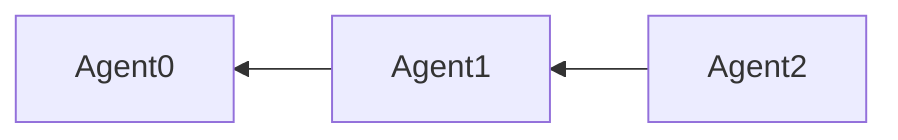
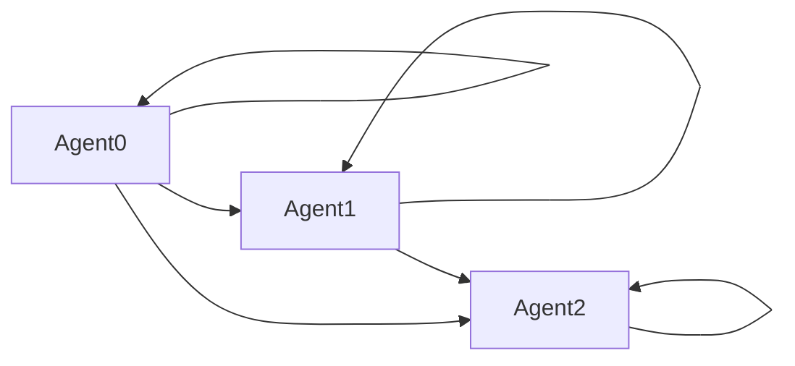

# Publishing and Subscribing

In order for a Skywing collective to perform useful work, its operable
agents need to be able to share data and results of computations with
each other. But because Skywing is intended for situations with
unreliable hardware, and therefore unreliable agents, we can never
fully rely on any given agent to be available and functioning when we
wish to speak with it. Therefore, we do not think of communications in
Skywing as being based on pairs of agents sending messages back and
forth.

Instead, we think of agents as **publishing** data they want the
collective to be able to use, and **subscribing** to data they want to
make use of. Crucially, publishing and subscribing is about *data*,
not *devices*. So when an agent decides it wishes to subscribe to a
stream of data, it is not asking any particular neighbor to provide
that data; instead, it is asking the collective in general to provide
that data. This comes with an understanding that
1. The data may or may not actually be available, and
2. It is not known, nor does it matter, which agent in the collective will provide that data.

This intentional uncertainty in subscription sources enables
resilience in acquisition of computational an intermediate
results. For example, often multiple agents will obtain the results of
some intermediate computation; by subscribing to *data* rather than
*devices*, agents performing subsequent work can seamlessly obtain
that data from whatever agent is functioning at the time.

## What happens behind a subscribe?

Frequently, a Skywing application is a streaming application, such as a
streaming sense-and-control loop. Therefore, data made available to
the collective is not a single, static piece of data, but is a data
*stream* that can be continually updated over time. A stream of
published data in the collective is uniquely identified by its **tag**,
which is a string-based name of the tag. Although multiple agents can
publish under the same tag, the expectation is that they are all
publishing the same data. That is, a data stream's tag does not
identify the agent(s) providing it, but it does uniquely identify the
data itself.

Recall from the [Introduction](01.\ Introduction.md) that an agent need
not know of every other agent in the collective at first, but only
that the graph of initial neighbors must be connected. When an agent
wishes to subscribe to a data stream, the following sequence of operations is exeucted:
1. The agent checks (via the stream's unique tag) if it publishes under that tag.
2. If not, it asks its immediate neighbors if they know any agent publishing under that tag. If they do, they communicate that information back to the subscribing agent, which then establishes a new connection (if necessary) with the publishing agent, establishing them as neighbors and finalizing the publish-subscribe pathway between the two.
3. If no neighbor knows of a publisher of that tag, they ask *their* neighbors. This initiates a search sequence that can propagate through the entire collective. When a publisher of the requested tag is found, that information propagates back through the collective to the requesting agent, which then reaches out to establish a new connection to the publisher.

# A Skywing application with pubs and subs

## First, a core programming construct in Skywing

Before we start doing things over a network, we need to introduce the
**Waiter**. Any operation that occurs over a network depends on
another agent or network device to complete the operation, which means
the initiating agent doesn't have complete control over when, or even
if, the operation completes. Therefore, we must design our programs in
a way that allows execution to continue while we wait for a networked
operation; furthermore, because Skywing deals with inherently
unreliable devices, an operation must be able to fail without it
causing a Skywing agent to crash.

To handle these requirements, Skywing provides the `Waiter<T>` class
template. A `Waiter<T>` is simply an object that waits for some
operation to complete asynchronously in the background, and possibly
returns to the user a `T` upon completion. The user can
 * Ask the `Waiter<T>` if the operation is complete without blocking.
 * Block and wait for the operation to complete.
 * Block and wait for a set amount of time, then return regardless of completion status.
 * Block and wait for the operation to complete, and then **get** the `T` upon completion.

The Waiter provides the guarantee that, upon returning its `T` to the
user, whatever operation that `T` depended on has completed and the
`T` is therefore "ready to go." `T` could represent some status
information about the result of the operation, or it could be an
object we wish to use. Upon calling and returning from
`Waiter<T>::get()`, we obtain a `T` object, and we have the *guarantee
from the Waiter* that this `T` is ready for use.

It is also possible to have a `Waiter<void>`, which doesn't return
anything to the user but still allows the user to test and wait for
the completion of asynchronous operations.

The `Waiter` class template can be found in
`skywing/skywing_core/waiter.hpp`. We will introduce more about the
Waiter as these tutorials progress.

Also in `waiter.hpp` is a class template called a `WaiterBuilder`,
which is used to construct complex waiters. We will come back to the
WaiterBuilder in the next tutorial.

## A Skywing program that makes connections and communicates

We will build on the example from the [previous tutorial](01.\ Introduction.md).
Let's go through the various programming pieces we will use.

### Making initial connections

Inside a job, we make a connection asking the Manager to
`connect_to_server`, in which we pass the IP address and listening
port number of the neighboring agent to which we wish to connect. This
returns a `Waiter<bool>` that, upon `get`ing, returns a Boolean
indicating whether or not the connection was made. A connection can
fail for a multitude of reasons, including that the neighbor simply
isn't ready yet, and so a false value doesn't necessarily indicate a
problem. Often, the correct response is to simply try again. Therefore,
we will keep trying until our connection succeeds:
```
bool connected = false;
while (!connected) {
  Waiter<bool> conn_waiter = manager_handle.connect_to_server(/*string*/ ip_address, /*uint16_t*/port_num);
  connected = conn_waiter.get();
}
```
Note that this code will block until the connection is made, which
might or might not be the correct behavior for your application.

### Setting up publications and subscriptions

Publication streams are uniquely identified by their tag. A **tag** is
both a type of the underlying data *and* a unique string ID. So to
declare a publication, we define the **tag type**, construct an
explicit string-identified tag, and then declare to the running Job
that we will publish under that tag. For example, to declare a
publication with an integer data type:
```
using pubtag_t = skywing::PublishTag<int>;
pubtag_t myTag{"tag_name"};
job.declare_publication_intent(myTag);
```

To subscribe to a data stream, we construct a tag of the desired
stream as we did for publications. However, subscribing to a stream
requires that the Skywing Manager initiative a search protocol within
the collective to identify, and then connect to, a publisher of that
stream. So a subscription request returns a Waiter that will complete
when the subscription does. This Waiter only completes when the
subscription is finalized, so it doesn't need to return a value:
```
pubtag_t desiredTag{"other_tag"};
Waiter<void> sub_waiter = job.subscribe(desiredTag);
sub_waiter.wait();
```
Note that `sub_waiter.wait()` will block until the subscription
finishes, which might or might not be the correct behavior for your
application. Other useful Waiter functions include `is_ready`,
`wait_for`, and `wait_until`.

### Publishing data and getting subscribed data

Publishing data is simple; once you have declared your publication
intent, you simply tell the Job whenever you have a new value:
```
int myVal = 100;
job.publish(myTag, myVal);
```
Once you do this, the Manager will send the new value to any agent that
has subscribed to this stream.  Recall that `myTag` represents a data
*stream*, so you can publish many times under the same tag.

To get data from a subscribed stream, you ask the Job for a Waiter to
the data. If the data type is an `int`, however, the Waiter is not a
`Waiter<int>` like you might expect. Instead, it's a
`Waiter<std::optional<int>>`. Why is this? An [std::optional](https://en.cppreference.com/w/cpp/utility/optional)
is an object that *might or might not contain a value*, and it can be
Boolean-tested to see if it does. We do this because a variety of
problems can happen in the underlying network or at the publishing
neighbor; maybe the neighbor has died! So a possible result of an
attempt to get data is for the operation to finish but fail, and the
`std::optional` allows us to capture this. To get data, then, we get
our `std::optional<int>` out of the Waiter, and then check if the
optional contains our data. If the optional contains data, it can be
accessed via a dereference-like operator:
```
Waiter<std::optional<int>> nbr_value_waiter = job.get_waiter(desiredTag);
std::optional<int> maybe_nbr_value = nbr_value_waiter.get();
if (maybe_nbr_value)
  int nbr_value = *maybe_nbr_value;
```
Note that the waiter call to `get()` will block until the operation
finishes, which may or may not be the correct behavior for your
application.

### Putting it all together

Now that we have our application pieces, let's put them together into
a collective that actually does something. We will create a collective
with three agents. Initial agent connections will look like the
following:

Note that Agent 0 connects to *no one* at first, it simply waits for
other agents to find it.

Next, we will have each agent publish an `int` stream, and will
subscribe to its own stream as well as all "subsequent" streams; that
is, Agent 1 will subscribe to "tag1" and "tag2" but not "tag0". If we
look at which agent-to-agent connections must be made to enable these
subscriptions, the diagram looks like this:

Note how Agent 0 must connect to both Agents 1 and 2 for its
subscriptions even though it didn't initially connect tothose. In
fact, the entire subscription pattern is opposite the original
connection pattern! This shows how Skywing's underlying tag search
protocol can find tags for an agent even when its immediate neighbors
don't publish them.

Finally, we put it all together into a program. Note how we frequently
chain multiple Waiter calls together in a single line for conciseness.
```
#include <iostream>
#include <vector>
#include <chrono>
#include "skywing_core/skywing.hpp"

std::vector<size_t> ports{20000, 20001, 20002};
using pubtag_t = skywing::PublishTag<int>;
std::vector<pubtag_t> tags = {pubtag_t{"tag0"}, pubtag_t{"tag1"}, pubtag_t{"tag2"}};

int main(const int argc, const char* const argv[])
{
  using namespace skywing;
  size_t machine_num = std::stoul(argv[1]);
  std::string machine_name = std::string("machine") + argv[1];
  Manager manager(ports[machine_num], machine_name);
  auto pubsub_job = [&](Job& job, ManagerHandle manager_handle)
  {
    // make initial connections
    if (machine_num > 0)
      while (!manager_handle.connect_to_server("localhost", ports[machine_num-1]).get()) ;

    // declare publication, subscribe and wait for subscriptions
    job.declare_publication_intent(tags[machine_num]);
    for (size_t i = machine_num; i < tags.size(); i++)
      job.subscribe(tags[i]).wait();

    // repeatedly submit and receive values
    int pub_val = 100 * machine_num;
    for (size_t i = 0; i < 10; i++) {
      job.publish(tags[machine_num], pub_val);
      for (size_t i = machine_num; i < tags.size(); i++) {
        if (std::optional<int> nbr_val = job.get_waiter(tags[i]).get()) {
          std::cout << machine_name << " received value " << *nbr_val;
          std::cout<< " from neighbor at port " << ports[i] << std::endl;
        }
      }
      pub_val++;
      std::this_thread::sleep_for(std::chrono::seconds(1));
    }
  };
  manager.submit_job("job", pubsub_job);
  manager.run();
}
```

### Running it

We compile it with the same type of command as last time:
```
g++ -std=c++17 ex2.cpp -o ex2 -I$(skywing_root)/skywing -I$(skywing_root)/subprojects/spdlog/include -I$(skywing_root)/subprojects/gsl/include -I$(skywing_root)/build/generated_files/generated `pkg-config capnp --cflags --libs` -L$(skywing_root)/build/skywing/skywing_core -lskywing_core
```

Like before, we will use a bash script to start up the processes
running the Skywing agents. This time we will use a slightly more
sophisticated script that keeps track of the created processes, and
automatically kills them after awhile. This is to ensure that, in case
anything going wrong, you don't wind up with a bunch of lost processes
still running on your computer:
```
#!/bin/bash

trap kill_progs EXIT
kill_progs() {
  for (( ind=0 ;  ind < size_of_collective ; ind++ ))
  do
      var="erase${ind}"
    kill -9 ${!var} > /dev/null 2> /dev/null
  done
}

size_of_collective=3
for (( agent_ind = 0; agent_ind < $size_of_collective ; agent_ind++ ))
do
    echo ./ex2 $agent_ind
    ./ex2 $agent_ind &
    declare "erase${agent_ind}=$!"
done
sleep 15
kill_progs
```

Alright, we are ready to go! We run this and get an output like the following:
```
$ source run2.sh
./ex2 0
./ex2 1
./ex2 2
machine2 received value 200 from neighbor at port 20002
machine1 received value 100 from neighbor at port 20001
machine0 received value 0 from neighbor at port 20000
machine2 received value 201 from neighbor at port 20002
machine1 received value 201 from neighbor at port 20002
machine2 received value 202 from neighbor at port 20002
machine1 received value 101 from neighbor at port 20001
machine1 received value 202 from neighbor at port 20002
machine0 received value 101 from neighbor at port 20001
machine0 received value 202 from neighbor at port 20002
machine2 received value 203 from neighbor at port 20002
machine1 received value 102 from neighbor at port 20001
machine1 received value 203 from neighbor at port 20002
machine0 received value 1 from neighbor at port 20000
machine0 received value 102 from neighbor at port 20001
machine0 received value 203 from neighbor at port 20002
machine2 received value 204 from neighbor at port 20002
machine1 received value 103 from neighbor at port 20001
machine1 received value 204 from neighbor at port 20002
machine0 received value 2 from neighbor at port 20000
machine0 received value 103 from neighbor at port 20001
machine0 received value 204 from neighbor at port 20002
machine2 received value 205 from neighbor at port 20002
machine0 received value 3 from neighbor at port 20000
machine1 received value 104 from neighbor at port 20001
machine1 received value 205 from neighbor at port 20002
machine0 received value 104 from neighbor at port 20001
machine0 received value 205 from neighbor at port 20002
machine2 received value 206 from neighbor at port 20002
machine0 received value 4 from neighbor at port 20000
machine1 received value 105 from neighbor at port 20001
machine1 received value 206 from neighbor at port 20002
machine0 received value 105 from neighbor at port 20001
machine0 received value 206 from neighbor at port 20002
machine2 received value 207 from neighbor at port 20002
machine0 received value 5 from neighbor at port 20000
machine1 received value 106 from neighbor at port 20001
machine1 received value 207 from neighbor at port 20002
machine0 received value 106 from neighbor at port 20001
machine0 received value 207 from neighbor at port 20002
machine2 received value 208 from neighbor at port 20002
machine1 received value 107 from neighbor at port 20001
machine1 received value 208 from neighbor at port 20002
machine0 received value 6 from neighbor at port 20000
machine0 received value 107 from neighbor at port 20001
machine0 received value 208 from neighbor at port 20002
machine2 received value 209 from neighbor at port 20002
machine1 received value 108 from neighbor at port 20001
machine1 received value 209 from neighbor at port 20002
machine0 received value 7 from neighbor at port 20000
machine0 received value 108 from neighbor at port 20001
machine0 received value 209 from neighbor at port 20002
machine1 received value 109 from neighbor at port 20001
machine0 received value 8 from neighbor at port 20000
machine0 received value 109 from neighbor at port 20001
machine0 received value 9 from neighbor at port 20000
[1]   Done                    ./ex2 $agent_ind
[2]-  Done                    ./ex2 $agent_ind
[3]+  Done                    ./ex2 $agent_ind
```